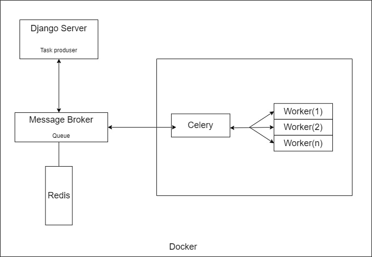
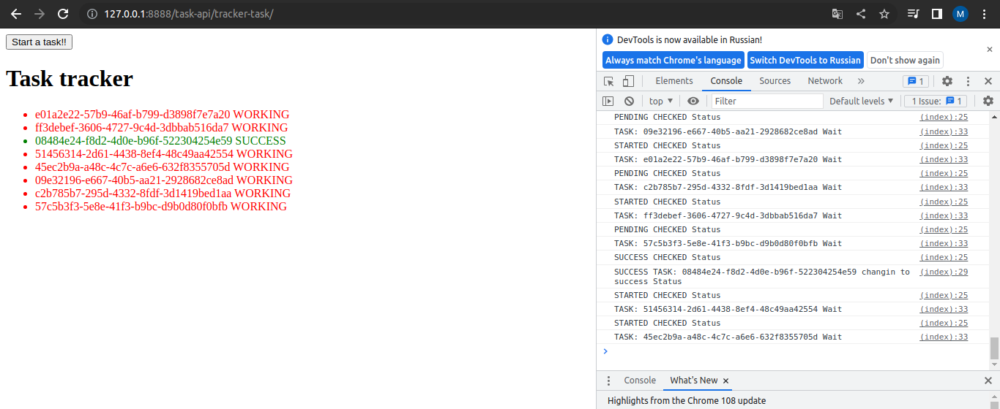

# Juve app
Repository for practice with Celery+Redis+Docker+Django
___
## Structure
**Celery** - Distributed Task Queue. It's a task queue with focus on real-time processing, while also supporting task scheduling.  
*Schema*:  

---
### Start development server(Linux):
After clone repository open the project folder in IDE and run command:

    python3 -m venv venv
    source venv/bin/activate
    cd webapp
    pip install -r requirements.txt
    cd src
    python manage.py migrate
    docker-compose up --build
___
### Endpoints
+ Refresh home page *http://127.0.0.1:8888/* several times to queue a tasks and execute them with Redis + Celery. In your directory **cats** pictures will be loaded in queue mode.
+ Set task *http://127.0.0.1:8888/task-api/settask/* Endpoint to create task and return task id
+ Get status task *http://127.0.0.1:8888/task-api/gettask/* Endpoint to get task status
+ Track task *http://127.0.0.1:8888/task-api/tracker-task/* Endpoint to track the execution of tasks  

### Track task
Click on button `Start a task` sever times to create task from browser window and tracks it. JS is using there.  

*poll/pull*
  
Window polls backend(Celery) about complete the task and as soon as it receives a response, SUCCESS changes the status and color of the task. After 5 seconds task will delete.  

